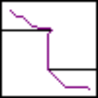

# RoboticsAlgorithms

### My Personal Space to practice Robotics Algorithms on planning, mapping, filtering & optimization.

## Planning

- Search-based: A* Planning\
  Simple A* planning with global obstacle map, compared to djikstra.\
   \

  LP-A* planning to do replan after slight map change. First pic is LP-A* planning for the first time. Second pic is replanned path after map changing.\
  

- Sample-based: PRM & RRT\
  Simple PRM & RRT(RRT*) planning with global obstacle map.\
   \
  RRT* can get the result optimized, but they both perform bad in maps having narrow channels.\
   

### Note: maps are from an open source github  [repo](https://github.com/XM522706601/robotics_tutorial_for_zhihu)

## Filtering

- Kalman Filter\
  Kalman filter simulation with simple motion model. Extended Kalman Filter is also implemented with same motion model adding nonlinearity by angle velocity.

## Optimization

- Minimum Snap Trajectory Optimization for quadrotor\
  The algorithm was implemented only the version of equalized time split and without corridor but it's relatively easy to change. Simply changing equality constraint to inequality can get it to the corridor version. In corridor version, it's OK for us to do collision detection and enable the robot to move. Time split can be calculated by acceleration and velocity. Also the trajectory was not the best. To be convenient for the simulation, we only consider 1st derivative continous on the connecting point.\
  
  >Reference: [1] Mellinger D, Kumar V. Minimum snap trajectory generation and control for quadrotors, Robotics and Automation (ICRA), 2011\
  >[2] Chen J, Liu T, Shen S. Online generation of collision-free trajectories for quadrotor flight in unknown cluttered environments, Robotics and Automation (ICRA), 2016
