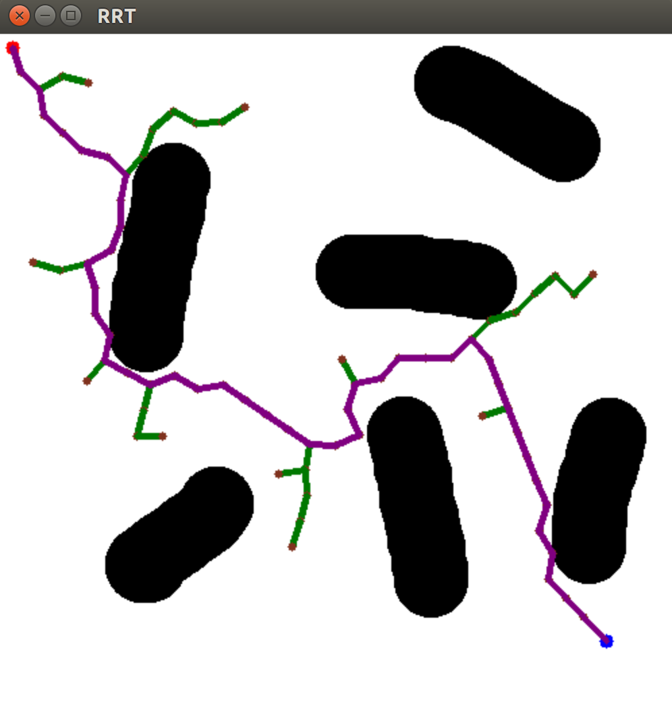
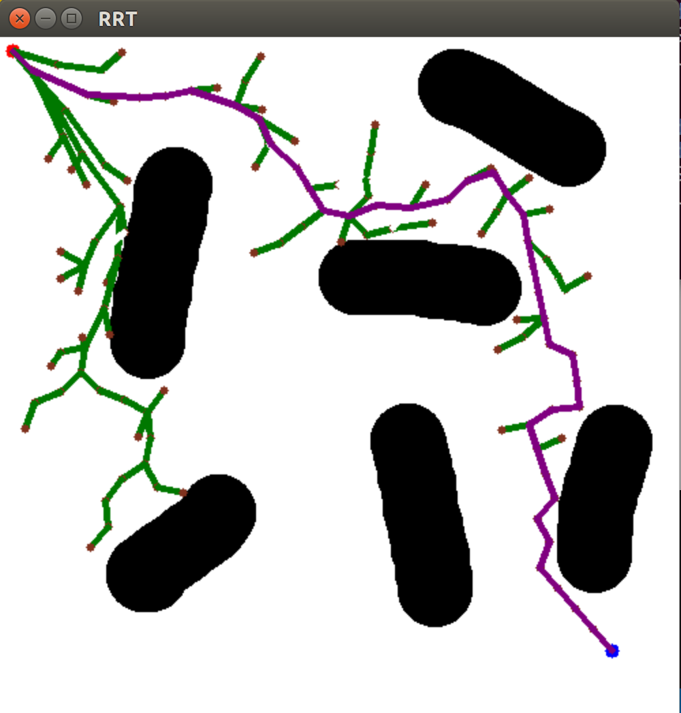

# RoboticsAlgorithms

### My Personal Space to practice Robotics Algorithms on planning, mapping, filtering & optimization. 

### Will be updating all the time !

- A* Planning\
  Simple A* planning with global obstacle map.
  
  Compare to Djikstra:
  

- PRM\
  Simple PRM planning with global obstacle map.
  

- RRT\
  Simple RRT planning with global obstacle map.
  

  However, slow due to its limit in complex maps that has narrow paths.
  

  Can be updated to RRT*, which have optimized the path cost by rewiring.
  

### Note: maps are from [an open source github repo](https://github.com/XM522706601/robotics_tutorial_for_zhihu)
