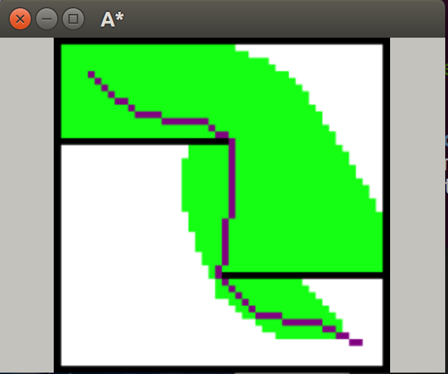

# RoboticsAlgorithms

### My Personal Space to practice Robotics Algorithms on planning, mapping, filtering & optimization. 

### Will be updating all the time !

- A* Planning\
  Simple A* planning with global obstacle map.\
  TO BE UPDATED - local obstacle map A* with different heuristic func
  

- RRT\
  Simple RRT planning with global obstacle map.\
  TO BE UPDATED - RRT* Algorithm
  

